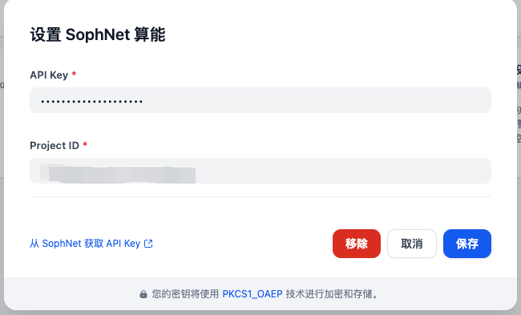
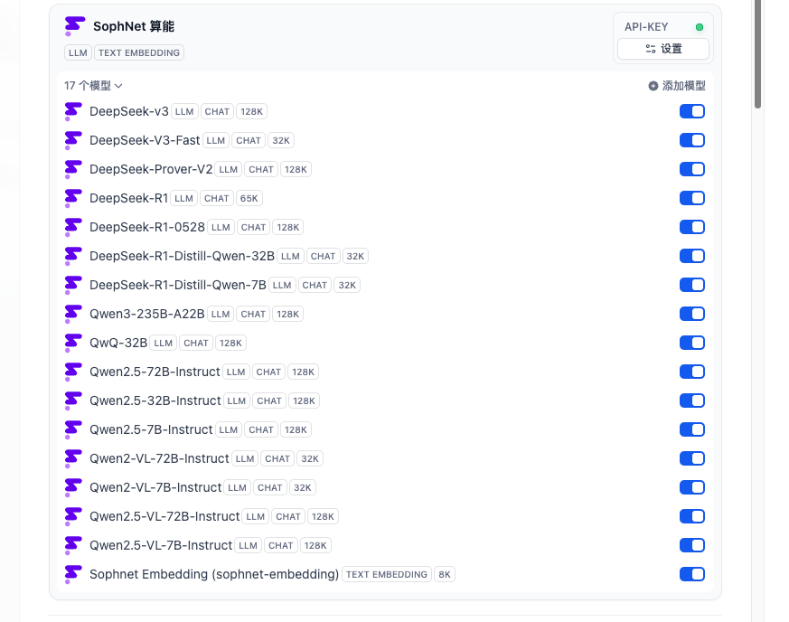

# Sophnet

SophNet provides full-blood DeepSeek R1/V3, Qwen, QwQ models, and its own DeepSeek V3 Fast model, as well as text-to-speech, speech-to-text, text embedding, image OCR, document parsing, and other models.

---

## Configure

After installing the plugin, configure your Sophnet settings in the Model Provider section. This includes your API key ([find it here](https://www.sophnet.com/#/project/key)) and Project ID. Save to use Sophnet.

---

## Features

### Large Language Models (LLM)
- Full access to DeepSeek R1/V3, Qwen, QwQ models
- Customizable parameters for each model
- Support for both chat and completion APIs

### Speech to Text
- Convert audio files to text transcriptions
- Support for multiple audio formats: wav, mp3, m4a, flv, mp4, wma, 3gp, amr, aac, ogg-opus, flac
- File size limit: 1GB
- Audio duration: up to 5 hours

### Text to Speech (TTS)
- Convert text to natural-sounding speech
- 14 different voice options in Chinese and English
- Adjustable parameters: volume, speech rate, pitch
- Streaming and non-streaming API support
- Multiple output audio formats

### Text Embedding
- Generate vector embeddings for text
- Configurable dimensions: 1024/768/512/256/128/64
- Optimized for semantic search and text analysis

---

## About Sophnet
Website [Sophnet](https://www.sophnet.com/)
Supported Models  [Models](https://www.sophnet.com/#/model/list)
Sophnet API Document [API](https://www.sophnet.com/docs/component/API.html)

---

## Documentation

- See [GUIDE.md](./GUIDE.md) for detailed usage, customization, and contribution instructions.
- Refer to code comments and docstrings for in-line documentation.

---

## License

This project is licensed under the MIT License. See the [LICENSE](./LICENSE) file for details.

---

## Privacy

For information on data handling and privacy, please refer to [PRIVACY.md](./PRIVACY.md).

---

## Contributing

Contributions are welcome! Please read [GUIDE.md](./GUIDE.md) for guidelines on how to get started.

---

## Contact

For questions, issues, or feature requests, please open an issue on GitHub or contact the maintainers.